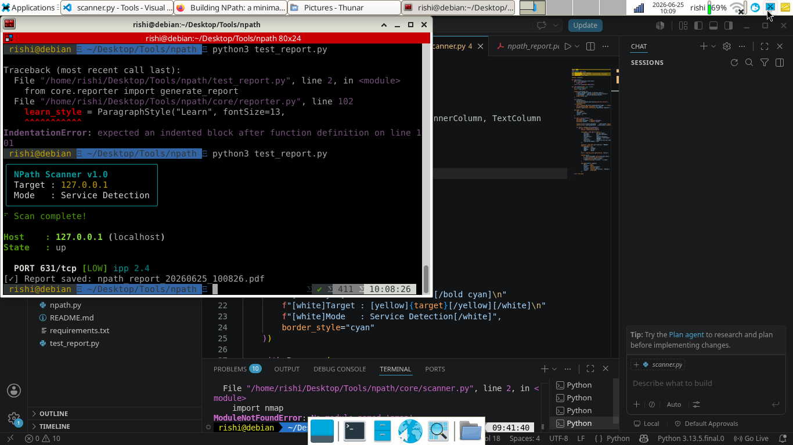
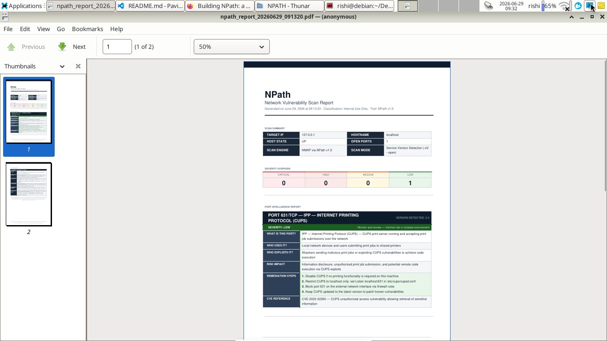
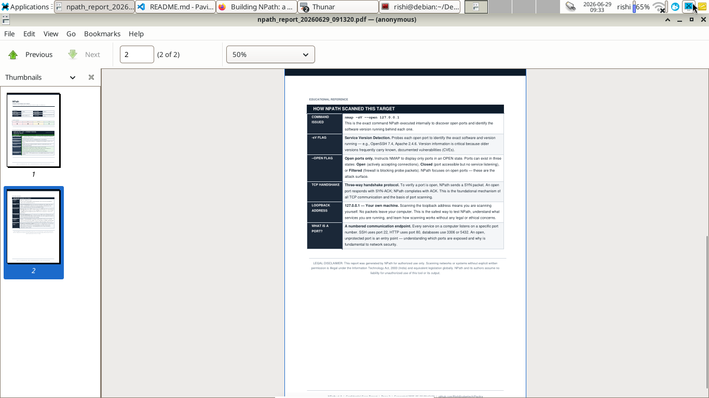

<div align="center">


<br/>

[](https://python.org)
[](LICENSE)
[]()
[]()
[]()
[]()


</div>

---

<div align="center">

### 🎯 What if NMAP came with a translator?

</div>

Raw NMAP output tells you a port is open. It does **not** tell you why that matters, who exploits it, or what to do about it. NPath closes that gap — it runs NMAP internally, matches every discovered port against a hand-written intelligence database of real CVEs and remediation steps, and hands you back a report a beginner can actually act on.

```diff
- PORT     STATE SERVICE VERSION
- 3389/tcp open  ms-wbt-server  Microsoft Terminal Services
+ ⚠ CRITICAL: Remote Desktop Protocol exposed
+ → This is the #1 ransomware entry point (BlueKeep, CVE-2019-0708)
+ → Fix: Put it behind a VPN. Never expose RDP directly.
```

---

## ⚡ Live in 30 Seconds

```bash
git clone https://github.com/Rishi0cybertech/Pavitra.git
cd Pavitra/NPATH
python3 -m venv venv && source venv/bin/activate
pip install -r requirements.txt
sudo apt install nmap -y

python3 npath.py scan 127.0.0.1 --report
```

That's it. A professional PDF lands in your folder, timestamped, ready to read.

---

## 📸 See It Work

<table>
<tr>
<td width="50%">

**Real-Time Terminal Intelligence**

Every port is classified the moment it's found — color-coded severity, live scan status, zero waiting for a report to know something's wrong.

</td>
<td width="50%">

**Company-Grade PDF Output**

Deep navy/steel palette. Structured per-port breakdowns. A dedicated education section that teaches NMAP concepts alongside the findings. No cheap templates.

</td>
</tr>
</table>





---

## 🧬 How It Thinks


---

## 🗺️ Scan Anything — One Host or a Whole Subnet

NPath doesn't stop at a single IP. Point it at a `/24` and it returns a unified, multi-host report — subnet overview table, aggregate severity counts, and a fully paginated per-host breakdown.

```bash
# Single host
python3 npath.py scan 192.168.1.1 --report

# Entire subnet — verified against a live 4-host environment
python3 npath.py scan 192.168.1.0/24 --report
```

<div align="center">

| Host | State | Open Ports | Highest Severity |
|:---:|:---:|:---:|:---:|
| `172.17.0.1` | 🟢 UP | 3 | 🟠 HIGH |
| `172.17.0.2` | 🟢 UP | 1 | 🟡 MEDIUM |
| `172.17.0.3` | 🟢 UP | 1 | 🟠 HIGH |
| `172.17.0.4` | 🟢 UP | 1 | 🔴 CRITICAL |

*Real output from a verified multi-container test environment.*

</div>

---

## 🧠 What Every Report Actually Contains

<table>
<tr><th width="30%">Section</th><th>What It Tells You</th></tr>
<tr><td><b>Scan Summary</b></td><td>Target, hostname, host state, total open ports — the vitals</td></tr>
<tr><td><b>Risk Score & Grade</b></td><td>A single number, 0–100, plus a letter grade — know your exposure at a glance</td></tr>
<tr><td><b>Subnet Overview</b></td><td>Multi-host scans get a comparison table — instantly see which host is worst</td></tr>
<tr><td><b>Per-Port Intelligence</b></td><td>What it is · who legitimately uses it · who exploits it · exact fix steps · real CVE</td></tr>
<tr><td><b>Educational Reference</b></td><td>What <code>-sV</code> and <code>--open</code> actually do, explained in plain English — every scan teaches you something</td></tr>
</table>

---

## 🗄️ The Intelligence Database

19 ports. Every entry hand-written with real CVE references — not generated filler.

<div align="center">

🔴 **CRITICAL** · FTP, Telnet, SMB, MySQL, RDP, PostgreSQL
🟠 **HIGH** · SSH, SMTP, DNS, POP3, IMAP, SNMP
🟡 **MEDIUM** · HTTP, NetBIOS, HTTP-Alt, HTTPS-Alt
🟢 **LOW** · HTTPS, IPP/CUPS

</div>

```json
{
  "3389": {
    "service": "RDP — Remote Desktop Protocol",
    "severity": "CRITICAL",
    "real_world_example": "CVE-2019-0708 — BlueKeep, a wormable RDP vulnerability..."
  }
}
```

Every entry follows this schema — `service`, `why_open`, `who_uses`, `who_exploits`, `risk`, `severity`, `how_to_fix`, `real_world_example`. Contributions welcome; see below.

---

## 🚀 Full Installation

<details>
<summary><b>Click to expand complete setup instructions</b></summary>

### Requirements
- Python 3.10+
- NMAP installed on system
- Linux recommended (Kali, Debian, Ubuntu)

### Steps

```bash
git clone https://github.com/Rishi0cybertech/Pavitra.git
cd Pavitra/NPATH

python3 -m venv venv
source venv/bin/activate

pip install -r requirements.txt

sudo apt install nmap
```

### Usage

```bash
# Scan, terminal output only
python3 npath.py scan 127.0.0.1

# Scan and generate PDF
python3 npath.py scan 127.0.0.1 --report

# Short flag
python3 npath.py scan 192.168.1.1 -r

# Help
python3 npath.py --help
```

</details>

---

## 📁 Under the Hood

```
NPATH/
├── core/
│   ├── scanner.py        # NMAP interface — returns a list of host results
│   ├── reporter.py       # PDF generator — handles 1 host or 50
│   └── analyzer.py       # Risk scoring, grade A–F, port prioritization
├── data/
│   └── port_intel.json   # 19 ports, hand-written, real CVEs
├── screenshots/
├── npath.py               # CLI entry point
├── test_report.py
└── requirements.txt
```

---

## ✅ Shipped

```
│   ├── terminal_ui.png   # Terminal scan UI preview
│   ├── report_page1.png  # PDF report page 1 preview
│   └── report_page2.png  # PDF report page 2 preview
├── npath.py              # ✅ Working CLI entry point
├── test_report.py        # Direct scan + PDF script
├── requirements.txt      # Python dependencies
└── README.md
```

---

## 🗄️ Port Intelligence Database

NPath maintains a `port_intel.json` database — the brain of the tool.

Current coverage — **21 ports with real CVE references:**

| Port | Service | Severity |
|------|---------|----------|
| 21 | FTP — File Transfer Protocol | 🔴 CRITICAL |
| 22 | SSH — Secure Shell | 🟠 HIGH |
| 23 | Telnet — Unencrypted Remote Access | 🔴 CRITICAL |
| 25 | SMTP — Simple Mail Transfer Protocol | 🟠 HIGH |
| 53 | DNS — Domain Name System | 🟠 HIGH |
| 80 | HTTP — Hypertext Transfer Protocol | 🟡 MEDIUM |
| 110 | POP3 — Post Office Protocol v3 | 🟠 HIGH |
| 139 | NetBIOS — Network Basic Input Output System | 🟡 MEDIUM |
| 143 | IMAP — Internet Message Access Protocol | 🟠 HIGH |
| 443 | HTTPS — HTTP over TLS | 🟢 LOW |
| 445 | SMB — Server Message Block | 🔴 CRITICAL |
| 631 | IPP — Internet Printing Protocol (CUPS) | 🟢 LOW |
| 3306 | MySQL — Database Server | 🔴 CRITICAL |
| 3389 | RDP — Remote Desktop Protocol | 🔴 CRITICAL |
| 5432 | PostgreSQL — Database Server | 🔴 CRITICAL |
| 5900 | VNC — Virtual Network Computing | 🔴 CRITICAL |
| 8080 | HTTP Alternate — Development/Proxy Server | 🟡 MEDIUM |
| 8443 | HTTPS Alternate — Secure Admin Interface | 🟡 MEDIUM |
| 2121 | Alternative FTP — Custom File Transfer Service | 🟡 MEDIUM |
| 2222 | Alternative SSH — Secure Remote Administration | 🔴 CRITICAL |
> Database actively expanding — contributions welcome.

### Database Schema
```json
{
  "PORT_NUMBER": {
    "service": "Service name",
    "why_open": "Why this port runs",
    "who_uses": "Legitimate users",
    "who_exploits": "Attack vectors",
    "risk": "Impact if compromised",
    "severity": "LOW | MEDIUM | HIGH | CRITICAL",
    "how_to_fix": ["Step 1", "Step 2", "Step 3"],
    "real_world_example": "CVE reference"
  }
}
```

---

## 📦 Dependencies

```
python-nmap     — NMAP Python interface
reportlab       — Professional PDF generation
rich            — Beautiful terminal output
typer           — CLI interface
```

---

## ✅ Completed So Far

- [x] Core scanner with NMAP wrapper
- [x] Professional PDF report generation
- [x] Severity color coding (CRITICAL / HIGH / MEDIUM / LOW)
- [x] Real-time terminal UI with rich
- [x] Port intelligence database with real CVEs
- [x] Learning section in PDF — teaches NMAP concepts
- [x] Unique timestamped PDF per scan
- [x] Working CLI — `python3 npath.py scan <target> --report`
- [x] Port intel database expanded to 18 ports
- [x] Company-grade professional PDF layout
- [x] Risk scoring engine — grade A to F
- [x] Port prioritization — critical ports first
- [X] Subnet scanning — `python3 npath.py scan 192.168.1.0/24 --report
- [x] NMAP integration with real-time Rich terminal UI
- [x] Company-grade PDF reports — navy/steel palette, zero cheap templates
- [x] 19-port intelligence database with real CVE references
- [x] Risk scoring engine — grade A through F
- [x] **Multi-host subnet scanning — verified against a live 4-host environment**
- [x] Working CLI with `--report` / `-r` flags
- [x] Educational reference section baked into every report

## 🔭 Next
- [ ] Port intel expanded past 19
- [ ] OS detection integrated into reports
- [ ] HTML export alongside PDF
- [ ] Auto-sync CVE data from the NVD API
- [ ] Cross-reference with **WaveTrace** — Pavitra's live packet analyze
- [ ] OS detection section in report
- [ ] HTML report export option
- [ ] Auto-update CVE database from NVD API
- [ ] Integration with WaveTrace — cross-reference open ports with live traffic
- [ ] DRISHTI AI integration — Hindi + English explanations

---

## ⚠️ Use Responsibly

NPath is built for authorized use only — your own machines, your own networks, or explicit written permission. Unauthorized scanning is illegal under the IT Act 2000 (India) and equivalent laws elsewhere. This tool teaches; it doesn't grant permission.

---

## 🤝 Contributing

Found a port missing from the database? Open a PR with:
- Port number and service name
- A real CVE reference — not placeholder text
- Concrete remediation steps

---

<div align="center">


**[⭐ Star](https://github.com/Rishi0cybertech/Pavitra)** · **[🐛 Report Issue](https://github.com/Rishi0cybertech/Pavitra/issues)** · **[🔀 Fork](https://github.com/Rishi0cybertech/Pavitra/fork)**

</div>
