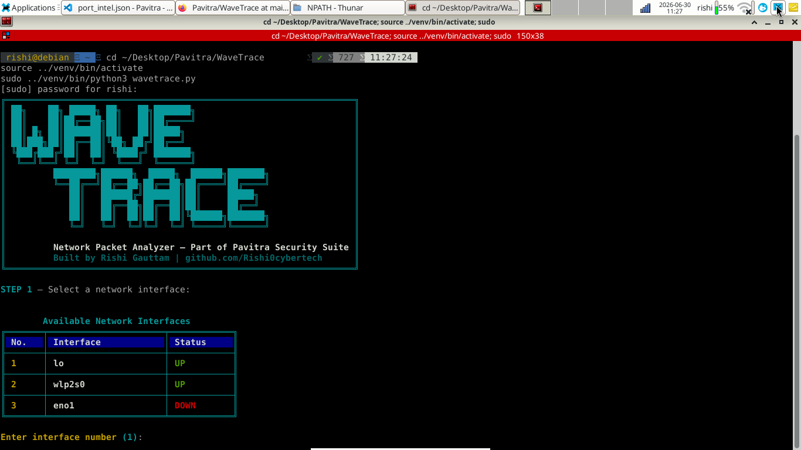
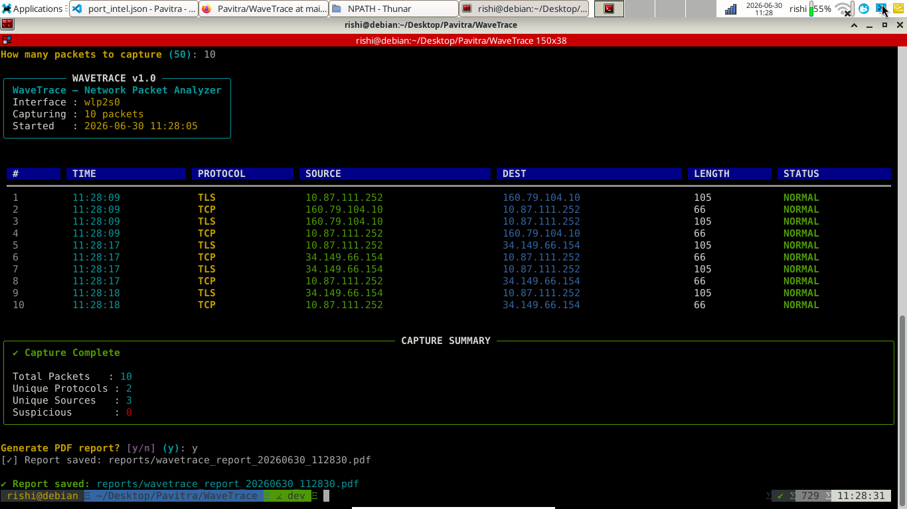
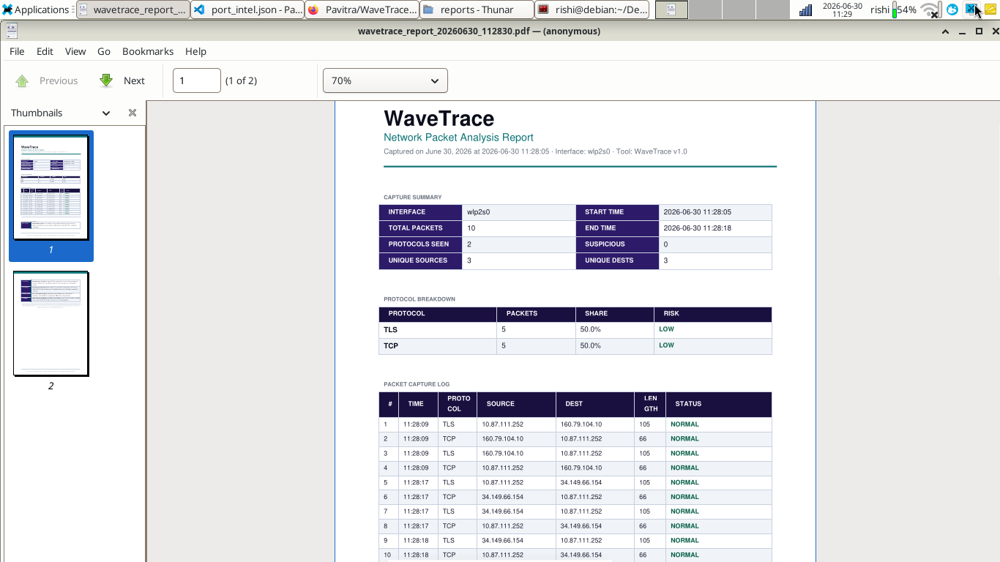
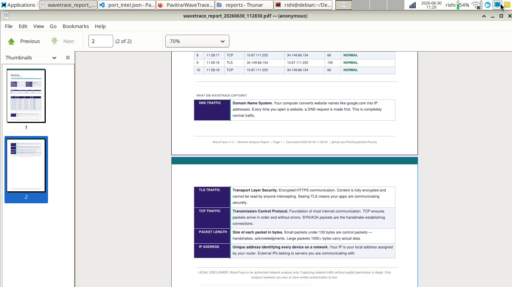

<div align="center">

# 🌊 WaveTrace — Network Packet Analyzer

**See your network traffic. Understand every packet. No Wireshark expertise required.**

[](https://python.org)
[](LICENSE)
[](https://github.com/Rishi0cybertech/Pavitra)
[]()
[]()

> *"Wireshark shows you packets. WaveTrace tells you what they mean."*

</div>

---

## 📸 Screenshots

### Terminal UI — Interface Selection


### Terminal UI — Live Packet Capture


### PDF Report — Page 1


### PDF Report — Page 2


---

## 🤔 The Problem WaveTrace Solves

Wireshark is the industry-standard packet analyzer — and it is overwhelming for beginners.

When you open Wireshark for the first time, you see thousands of rows like this:

```
192.168.1.5 → 8.8.8.8     DNS    Standard query A google.com
192.168.1.1 → 192.168.1.5 TCP    [SYN, ACK] Seq=0 Ack=1 Win=64240
192.168.1.5 → 13.67.9.5   TLS    Client Hello
```

**Three questions immediately hit you:**
- Is this traffic normal or suspicious?
- What is actually happening on my network right now?
- Which of these thousands of packets actually matter?

Wireshark gives you everything. **WaveTrace gives you clarity.**

---

## ✨ What WaveTrace Does

WaveTrace builds an intelligence layer on top of TShark (Wireshark's command-line engine) to capture live network traffic, classify it by risk, and generate a clean, professional PDF report — explaining what was captured, in plain English.

```
You select a network interface
        ↓
WaveTrace captures live packets via TShark
        ↓
Each packet is classified — protocol, source, destination, risk
        ↓
Suspicious traffic is automatically flagged
        ↓
A professional PDF report is generated
        ↓
You understand exactly what your network is doing
```

---

## 📄 Real Capture Example

Here is a real 15-packet capture from an active network interface:

| Metric | Result |
|--------|--------|
| Total Packets | 15 |
| Unique Protocols | 3 (DNS, TCP, TLS) |
| Unique Sources | 4 |
| Suspicious Traffic | 0 |

**What was found:**
- DNS queries resolving domain names — normal browsing activity
- TLS traffic to Microsoft servers — encrypted, secure communication
- TCP handshakes establishing legitimate connections

> ✅ Clean network — no suspicious ports or unencrypted credential traffic detected.

---

## 🧠 What The PDF Report Contains

Every generated report includes:

### 1. Capture Summary
- Interface used, start and end time
- Total packets captured
- Protocol diversity count
- Unique source and destination IP count
- Suspicious traffic count

### 2. Protocol Breakdown
| Field | What It Tells You |
|-------|-------------------|
| **Protocol** | DNS, TCP, TLS, HTTP, etc. |
| **Packet Count** | How many packets of this type |
| **Traffic Share** | Percentage of total capture |
| **Risk Level** | LOW / MEDIUM / HIGH based on protocol |

### 3. Suspicious Traffic Detection
WaveTrace flags traffic on known risky ports automatically:

| Port | Flagged As |
|------|-----------|
| 21 | FTP — Cleartext credentials |
| 23 | Telnet — Unencrypted remote access |
| 4444 | Metasploit default port |
| 6667 | IRC — Potential botnet C2 |
| 31337 | Elite hacker port |

### 4. Full Packet Log
Every captured packet listed with timestamp, protocol, source, destination, length, and status (NORMAL / SUSPICIOUS).

### 5. Educational Reference
WaveTrace explains what it captured — DNS, TLS, TCP, packet length, and IP addressing — so the report teaches networking concepts alongside the findings.

---

## 🚀 Installation

### Requirements
- Python 3.10+
- TShark (Wireshark CLI engine)
- Linux recommended (Kali, Debian, Ubuntu)
- Root/sudo access (required for packet capture)

### Step 1 — Clone the repository
```bash
git clone https://github.com/Rishi0cybertech/Pavitra.git
cd Pavitra/WaveTrace
```

### Step 2 — Create virtual environment
```bash
python3 -m venv venv
source venv/bin/activate
```

### Step 3 — Install dependencies
```bash
pip install -r requirements.txt
```

### Step 4 — Install TShark
```bash
sudo apt install tshark -y
```
> When prompted "Should non-superusers be able to capture packets?" — select **Yes**.

---

## ⚡ Usage

```bash
# Activate virtual environment
source venv/bin/activate

# Run WaveTrace (requires sudo for live capture)
sudo venv/bin/python3 wavetrace.py
```

### Interactive Flow

```
STEP 1 → Select a network interface from the list
STEP 2 → Choose number of packets to capture
STEP 3 → Live capture runs with real-time terminal table
STEP 4 → Capture summary displayed
STEP 5 → Choose to generate PDF report (y/n)
```

### Terminal Output

```
╔══════════════════════════════════════════════════════╗
║              WAVETRACE v1.0                           ║
║   Network Packet Analyzer — Pavitra Security Suite    ║
╚══════════════════════════════════════════════════════╝

STEP 1 — Select a network interface:

  #   Interface          Status
  1   lo                 UP
  2   enx06100f909a66    UP
  3   eno1               DOWN

✔ Selected: enx06100f909a66

  #   TIME       PROTOCOL   SOURCE            DEST              STATUS
  1   10:27:02   DNS        10.169.224.181    10.169.224.223    NORMAL
  2   10:27:02   TLS        10.169.224.181    150.171.110.81    NORMAL

✔ Capture Complete — 15 packets, 0 suspicious

Generate PDF report? (y): y
✔ Report saved: reports/wavetrace_report_20260629_103456.pdf
```

---

## 📁 Project Structure

```
WaveTrace/
├── core/
│   ├── capture.py        # TShark intelligence engine + live terminal UI
│   └── reporter.py       # Professional PDF generator
├── data/
│   └── protocol_intel.json  # Protocol risk classification (planned)
├── screenshots/
│   ├── terminal_ui_1.png    # Interface selection preview
│   ├── terminal_ui_2.png    # Live capture preview
│   ├── report_page1.png     # PDF report page 1 preview
│   └── report_page2.png     # PDF report page 2 preview
├── reports/               # Generated PDF reports
├── wavetrace.py           # CLI entry point
├── requirements.txt       # Python dependencies
└── README.md
```

---

## 📦 Dependencies

```
pyshark         — Python interface for TShark packet capture
scapy           — Low-level packet manipulation (planned features)
reportlab       — Professional PDF generation
rich            — Live terminal UI and tables
psutil          — Network interface detection
```

---

## ✅ Completed So Far

- [x] Network interface detection and selection
- [x] Live packet capture via TShark/Pyshark
- [x] Real-time terminal UI with live updating table
- [x] Protocol classification (DNS, TCP, TLS, etc.)
- [x] Suspicious port detection (Telnet, FTP, Metasploit, IRC, etc.)
- [x] Professional PDF report generation
- [x] Protocol breakdown with risk levels
- [x] Full packet capture log in report
- [x] Educational reference section in PDF
- [x] Distinct visual identity from NPath (purple/teal theme)

---

## 🗺️ Roadmap — What's Coming Next

### Phase 2 — Deeper Analysis
- [ ] `protocol_intel.json` — full protocol knowledge database with CVEs
- [ ] HTTP/HTTPS payload inspection (where legally permitted)
- [ ] Bandwidth usage graphs per source IP
- [ ] Top talkers visualization (who is using the most data)

### Phase 3 — File-Based Analysis
- [ ] Import and analyze existing `.pcap` / `.pcapng` files
- [ ] Compare captures across time periods
- [ ] Export findings to JSON for integration with other Pavitra tools

### Phase 4 — Advanced Detection
- [ ] ARP spoofing detection
- [ ] DNS tunneling detection
- [ ] Port scan detection (identify when someone is scanning you)
- [ ] Integration with NPath — cross-reference open ports with live traffic

### Phase 5 — Pavitra Platform Integration
- [ ] Web-based live capture dashboard
- [ ] DRISHTI AI integration — Hindi + English traffic explanations
- [ ] Part of NETRA Labs — capture traffic during simulated attacks

---

## ⚠️ Legal Disclaimer

WaveTrace is built strictly for:
- Educational purposes
- Monitoring your own network and devices
- Authorized network security assessments

**Capturing network traffic without explicit permission is illegal.**
Only analyze networks you own or have written authorization to test.
Unauthorized packet capture is illegal under IT Act 2000 (India) and equivalent legislation globally.

---

## 🤝 Contributing

Pull requests are welcome. For major changes, open an issue first.

If you want to contribute to `protocol_intel.json` — submit entries with:
- Protocol name
- Common legitimate use
- Risk indicators
- Real-world abuse examples

---

<div align="center">

**Part of the Pavitra Security Suite.**
**See your network. Understand every packet.**

⭐ Star this repo if WaveTrace helped you understand your network traffic.

</div>
